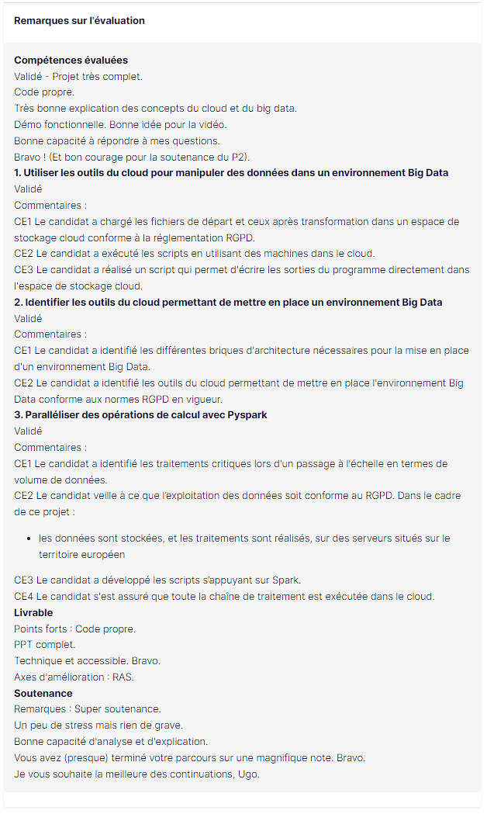

# Fruits! - AgriTech Data Processing Project

## Description
Welcome to Fruits!, a cutting-edge AgriTech startup dedicated to revolutionizing fruit harvesting through innovative solutions. Our mission is to preserve fruit biodiversity by developing intelligent robotic pickers tailored for each fruit species.

## Project Overview
In our initial phase, Fruits! aims to create awareness among the public regarding fruit biodiversity. We're introducing a mobile application that enables users to capture images of fruits and obtain detailed information about them. This application not only educates users about fruit diversity but also serves as the foundation for our image classification engine.

## Data Processing and Big Data Architecture
We have a dataset comprising fruit images and associated labels. The data processing tasks involve completing the work initiated by a former intern, enhancing our data processing pipeline, and setting up the initial version of our Big Data architecture. 

## Mission Objectives
- **Data Processing:** Review and extend the work done by the intern, focusing on scalable solutions.
- **Big Data Architecture:** Implement an operational EMR instance and expand the PySpark script.
- **Model Integration:** Address the missing steps, including broadcasting model weights and PCA dimension reduction.
- **Privacy Compliance:** Ensure GDPR compliance in data processing, especially in a European server environment.
- **Cost Management:** Operate the EMR instance judiciously to minimize expenses, limiting it to tests and demos.

## Project Structure
1. **Notebooks**: Jupyter notebooks containing the data processing scripts.
    - `DataProcessing.ipynb`: Jupyter notebook detailing the PySpark scripts, EMR setup, and model integration steps.
  
2. **Data**: Folder containing the dataset used for the analysis.
    - Data can be found here : https://www.kaggle.com/datasets/moltean/fruits

3. **Scripts**: PySpark scripts and configuration files.
    - `data_processing.py`: PySpark script for data processing and EMR setup.
    - `emr_config.json`: Configuration file for EMR setup.

4. **Results**: Folder containing output files and visualizations.
    - `ProcessedData & PCA results`: They can be found publicly on my S3 storage (see presentation for more informations) 

5. **Documentation**: Folder containing additional resources.
    - `DistributedModelInference.pdf`: Documentation on distributing model inference using TensorFlow Keras.
    - `GDPR_Compliance_Guide.pdf`: Guide on GDPR compliance in Big Data processing.


## Skills and assessment 


_work in progress_

## How to Run the Data Processing Scripts
1. **Requirements**: Ensure you have Python, PySpark, and AWS CLI installed on your system. Refer to `requirements.txt` for specific library versions.

2. **Clone the Repository**: Clone this repository to your local machine using the following command:
   ```
   git clone <repository-url>
   ```

3. **Navigate to Scripts Directory**: Go to the `Scripts` directory in your terminal:
   ```
   cd Scripts
   ```

4. **Set Up AWS Credentials**: Configure your AWS credentials using the AWS CLI:
   ```
   aws configure
   ```

5. **Run PySpark Script**: Execute the PySpark script to process the data and set up the EMR instance:
   ```
   spark-submit --master yarn data_processing.py
   ```

6. **Access Processed Data**: Check the `Results/ProcessedData` folder for processed data files.

7. **Explore PCA Plots**: Visualize the PCA results in the `Results/PCA_Plots` folder.
